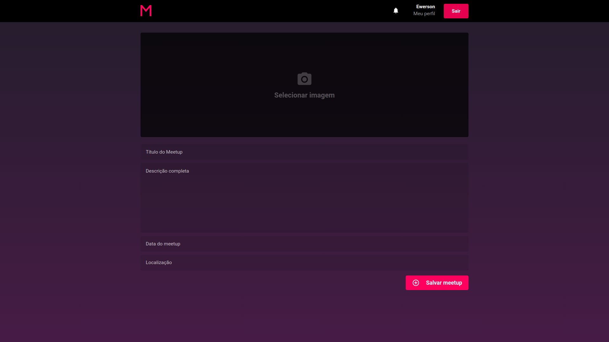

# MeetApp - Frontend
A React App created on Rocketseat's 9th Bootcamp module.

## Environment
- OS: Ubuntu 18.04
- Text editor: VS Code 1.39.2

## Tools
- Axios
- Datefns
- ESLint
- Immer
- Polished
- Prettier
- ReactJS
- React Icons
- Reactotron
- React Toastify
- Redux
- Redux Saga
- Styled Components
- Unform
- Yup

You can find the backend of this project on [this link](https://github.com/v1eira/bootcamp-desafio-03)

## Running the app:
Inside the project folder, do:
```bash
$ yarn start
```

## Screens





